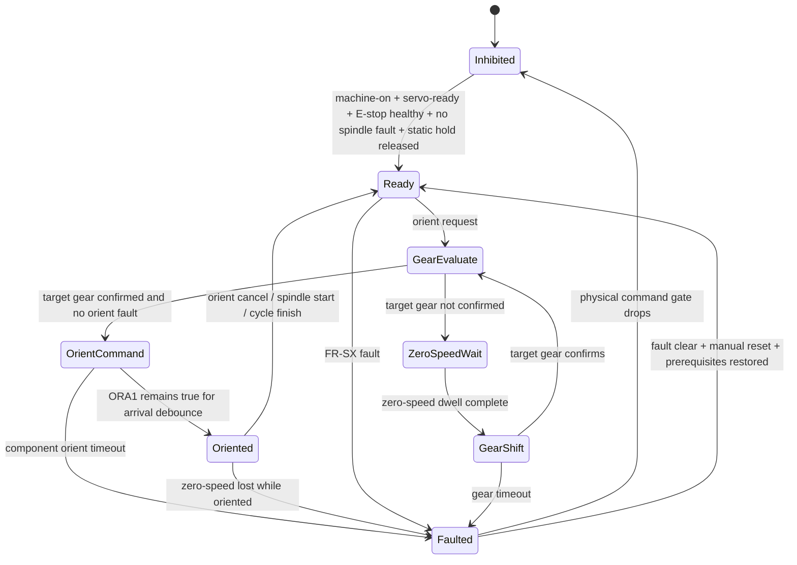

# FR-SX speed, gear, and orient state diagram

Status: active software model documented; exact FR-SX model/terminals,
polarities, timer base, and physical timing remain unverified.

The physical ORCM1, FWD, REV, RUN, and AOUT3-enable paths require
`spindle-motion-permit`, which combines the static commissioning hold,
watchdog health, E-stop latch, machine-on, servo-ready, and inverted spindle
fault. A drive fault also feeds `mazak-orient.drive-fault` and the ATC abort.
This is software inhibition, not a replacement for the hardwired stop chain.

## Current logical assignments

| Function | Current authority | Evidence state |
|---|---|---|
| FWD / REV / RUN | 7i84U-A OUT0/OUT1/OUT2 | COMMISSIONING_PENDING |
| AOUT3 speed command | 7i49 pwmgen.03 | COMMISSIONING_PENDING; signed-vs-magnitude mode unresolved |
| ORCM1 orient command | 7i84U-A OUT4 | PROPOSED |
| CTL low-gear assist | 7i84U-A OUT5 | PROPOSED |
| ORA1 orient arrival | 7i84U-A IN4 | PROPOSED |
| SZS zero speed | 7i84U-A IN5 | PROPOSED |
| Speed reach | 7i84U-A IN13 | COMMISSIONING_PENDING |
| FR-SX fault | 7i84U-A IN14 | COMMISSIONING_PENDING |
| SSET drive arm | HAL net only; no physical output assigned | UNBOUND |

## Distinct timeout layers

| Parameter | Current value | Role | Status |
|---|---:|---|---|
| `mazak-orient.zero-speed-dwell` | 0.3 s | gear-shift prerequisite | Unverified OEM timer base |
| `mazak-orient.arrival-debounce` | 0.3 s | ORA1 qualification | Unverified OEM timer base |
| `mazak-orient.orient-timeout` | 10.0 s | component AL45 watchdog | Unverified OEM timer base |
| `[ATC] ORIENT_TIMEOUT` | 15.0 s | outer M6 wait | Engineering outer bound; must remain longer than accepted component watchdog |

Do not call the two orient timeouts the same setting. Measure ORCM1-to-ORA1,
zero-speed, relay pickup/drop, and fault cleanup in both gear ranges and at all
approved starting speeds. Select final values from the measured worst case plus
a reviewed margin.

## Failure checks

- ORA1 never arrives: AL45, physical ORCM1 off, ATC fault/abort, no automatic
  retry.
- Zero speed drops while oriented: AL46, drive arm/orient off, ATC abort.
- FR-SX fault: all five motion-producing spindle paths off and ATC aborted.
- E-stop/watchdog/machine-ready/servo-ready loss: dynamic output permit off;
  confirm physical relay/drive response by measurement.
- Orient cancel while FWD/REV remains requested can return the drive to speed
  on the adjacent-family control model. The exact FR-SX manual and machine test
  must establish the safe command order before spindle commissioning.

Source and qualification details are in
[`frsx_orient_model.md`](frsx_orient_model.md).
